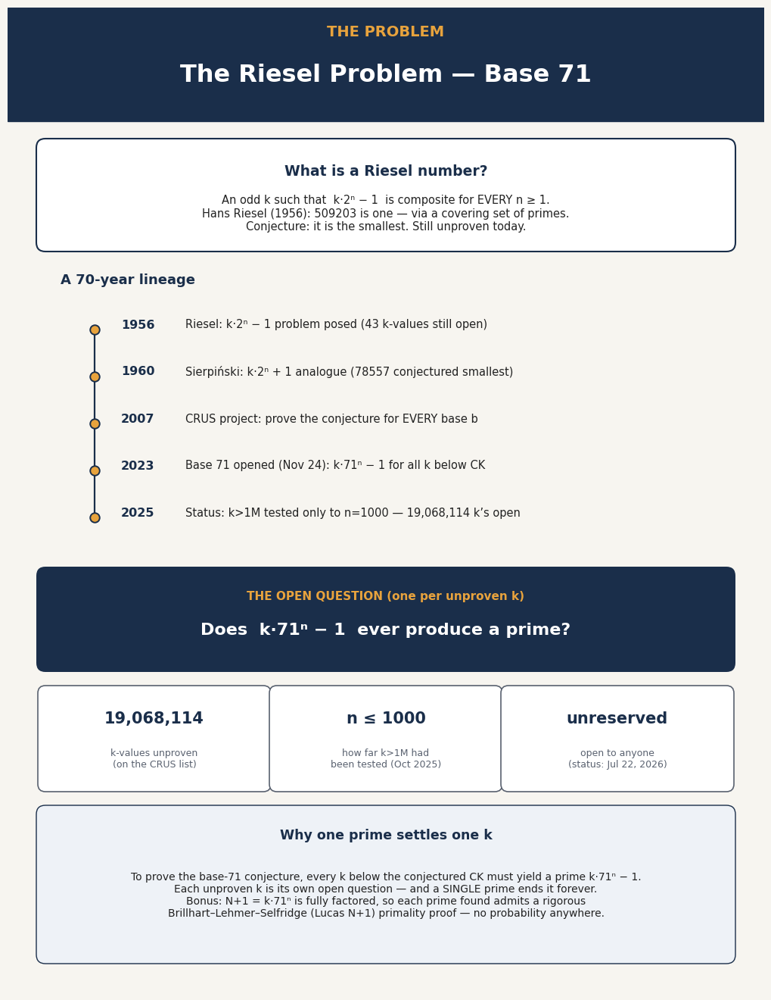
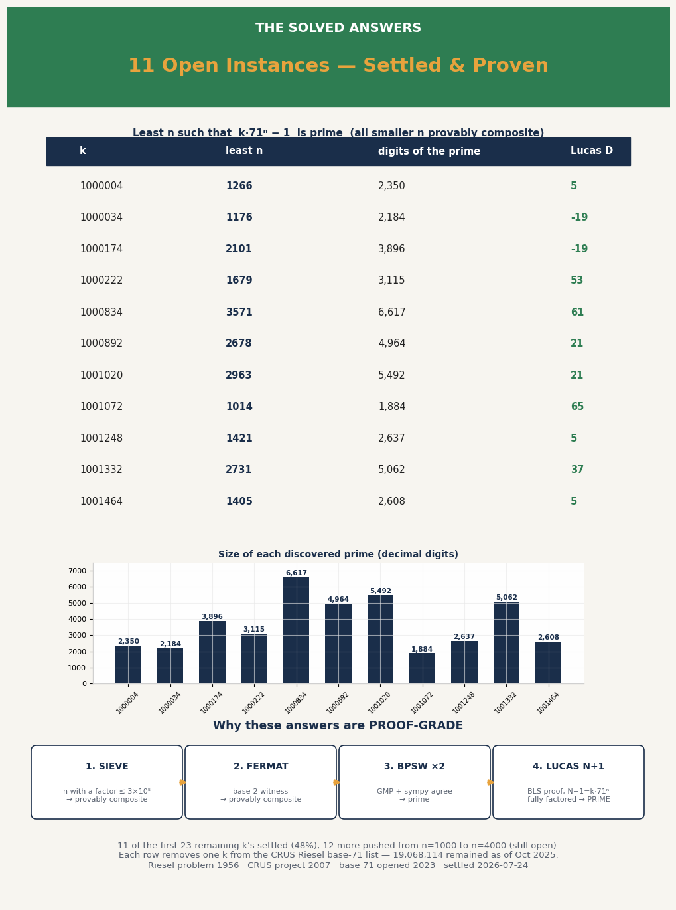

# Riesel Base-71 Settlements

**A public evidence package for 11 certified least-n results.**

This is a computational result about the Riesel base-71 conjecture. For each of 11 previously unproven k-values on the CRUS "Riesel base 71 remain" list, the least n such that k·71^n − 1 is prime was found and certified. Every smaller n is provably composite, and every prime is proven three independent ways (GMP Miller–Rabin, sympy BPSW, and a Brillhart–Lehmer–Selfridge Lucas N+1 proof).

[Read the full report](riesel-base-71-settlements.md) · [Verify every certificate](VERIFICATION.md) · [Download the certificates](data/riesel-71-certificates.jsonl) · [Inspect the raw results](data/riesel-71-raw-results.jsonl)

## Visual summary





[Download the two-page infographic PDF](assets/documents/riesel-base-71-infographics.pdf) · [Open the social header image](assets/images/x-header-3x1.png)

## Certified results

| k | least n | digits | Lucas D |
|---|---|---|---|
| 1000004 | 1266 | 2350 | 5 |
| 1000034 | 1176 | 2184 | −19 |
| 1000174 | 2101 | 3896 | −19 |
| 1000222 | 1679 | 3115 | 53 |
| 1000834 | 3571 | 6617 | 61 |
| 1000892 | 2678 | 4964 | 21 |
| 1001020 | 2963 | 5492 | 21 |
| 1001072 | 1014 | 1884 | 65 |
| 1001248 | 1421 | 2637 | 5 |
| 1001332 | 2731 | 5062 | 37 |
| 1001464 | 1405 | 2608 | 5 |

## Verification

`verify.py` recomputes each integer, proves that the listed `qs` values completely factor N+1, checks the supplied Lucas witness, and cross-checks `sympy.isprime(N)`.

```bash
python3 -m venv .venv
source .venv/bin/activate
python -m pip install -r requirements.txt
python verify.py data/riesel-71-certificates.jsonl
```

The [verification record](VERIFICATION.md) contains the exact output from a clean run. The original settlement and certification engines are preserved as [riesel-71-batch.py](code/riesel-71-batch.py) and [riesel-71-certify.py](code/riesel-71-certify.py).

## Honest scope

The base-71 conjecture itself is NOT solved — 19,068,114 k's remain open.

## Provenance and attribution

The source k-list is Gary Barnes's CRUS `remain-riesel-base71.zip`, file dated Nov 2 2025, from the [CRUS Riesel conjectures page](https://www.noprimeleftbehind.net/crus/Riesel-conjectures.htm). Status is stated only for the Oct 23 2025 base-page window and the Jul 22 2026 [reservations snapshot](https://www.noprimeleftbehind.net/crus/Riesel-conjecture-reserves.htm). CRUS coordination is via [Mersenneforum thread 6722](https://www.mersenneforum.org/node/6722).

Earlier related Beal and Sun computational work is preserved separately in the [beal-sun index](beal-sun/index.md).

## License

Data and text are released under CC0 1.0. Code is released under the MIT License. See [LICENSE.md](LICENSE.md).
